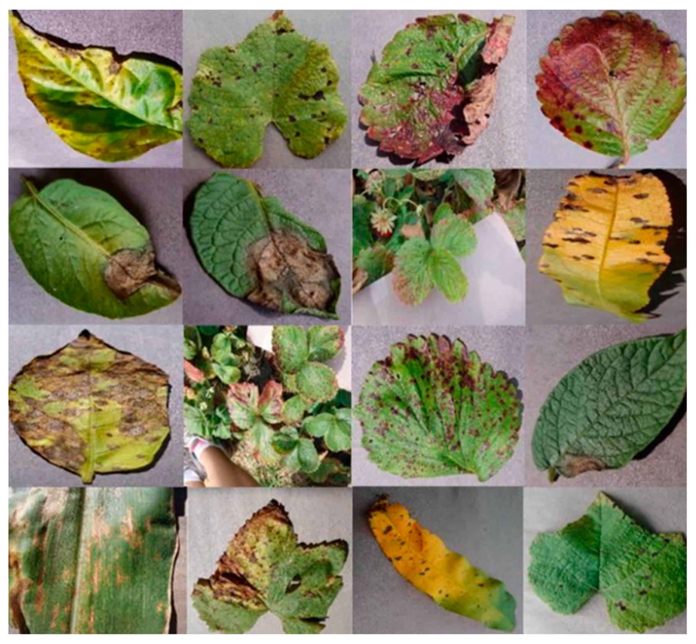

# AgriVision

AgriVision is an AI-powered mobile application designed to assist farmers by providing accurate weather forecasts, intelligent crop and fertilizer recommendations, and real-time plant disease & pest classification. The app is built with a user-friendly interface and supports multiple local languages to ensure accessibility even in rural areas.

---

## 📌 Features

### 🌦 Weather Forecasting
- Provides daily and 6-day weather forecasts.
- Helps farmers plan their agricultural activities efficiently based on predicted weather conditions.

### 🌱 Crop and Fertilizer Recommendation
- Uses key soil parameters such as:
  - **NPK Levels** (Nitrogen, Phosphorus, Potassium)
  - **pH Levels**
  - **Rainfall Data**
  - **Soil Moisture**
- Suggests the best crops to grow and the most suitable fertilizers to improve yield.

### 🦠 Plant Disease & Pest Classification
- **Online Mode:** Uses real-time AI models for disease and pest classification.
- **Offline Mode:** Works with a locally stored model, enabling classification even in low-connectivity areas.
- The model has been trained on a **diverse dataset covering 55 plant diseases and pest types**.

### 🌍 Local Language Support
- Ensures ease of use by integrating multiple language options for farmers in different regions.

---

## 🖼 Sample Dataset Image
The AI model powering the disease classification feature has been trained on real-world plant images. Below is an example of a dataset image used for training:



Download sample dataset image: [sample_dataset.jpg](https://github.com/sujithvaishnav/AgriVision/raw/main/screenshots/sample_dataset.jpg)

---

## 📸 App Screenshots

### Home Page
A simple and intuitive dashboard to navigate through the app features.


Download: [home.jpg](https://github.com/sujithvaishnav/AgriVision/raw/main/screenshots/home.jpg)

### Crop & Fertilizer Recommendation
Accurate suggestions based on soil and weather conditions.


Download: [crop_recommendation.jpg](https://github.com/sujithvaishnav/AgriVision/raw/main/screenshots/crop_recommendation.jpg)  
Download: [fertilizer_recommendation.jpg](https://github.com/sujithvaishnav/AgriVision/raw/main/screenshots/fertilizer_recommendation.jpg)

### Disease & Pest Classification
Easily detect plant diseases and pests using AI-powered classification.


Download: [disease_classification.jpg](https://github.com/sujithvaishnav/AgriVision/raw/main/screenshots/disease_classification.jpg)

### Local Language Support
Farmers can access all features in their preferred language.


Download: [language.jpg](https://github.com/sujithvaishnav/AgriVision/raw/main/screenshots/language.jpg)

---

## 🔧 Technologies Used
- **Machine Learning**: CNN-based plant disease and pest classification.
- **Deep Learning**: LLM APIs for enhanced recommendations.
- **API Integration**: Real-time weather and soil analysis.
- **Mobile App Development**: Designed for ease of use with multilingual support.

---

## 🚀 Installation & Usage

### Prerequisites
- Python 3.8+
- Required dependencies (install via requirements.txt)

### Steps to Run:
```bash
# Clone the repository
git clone https://github.com/sujithvaishnav/AgriVision.git

# Navigate to the project directory
cd AgriVision

# Install dependencies
pip install -r requirements.txt

# Run the application
python app.py
```

---

## 🤝 Contributing
We welcome contributions from the community! If you'd like to improve AgriVision, feel free to fork the repository and submit pull requests.

---

## 📜 License
This project is licensed under the MIT License.

---

## 📩 Contact
For any inquiries or support, reach out via [GitHub Issues](https://github.com/sujithvaishnav/AgriVision/issues).

